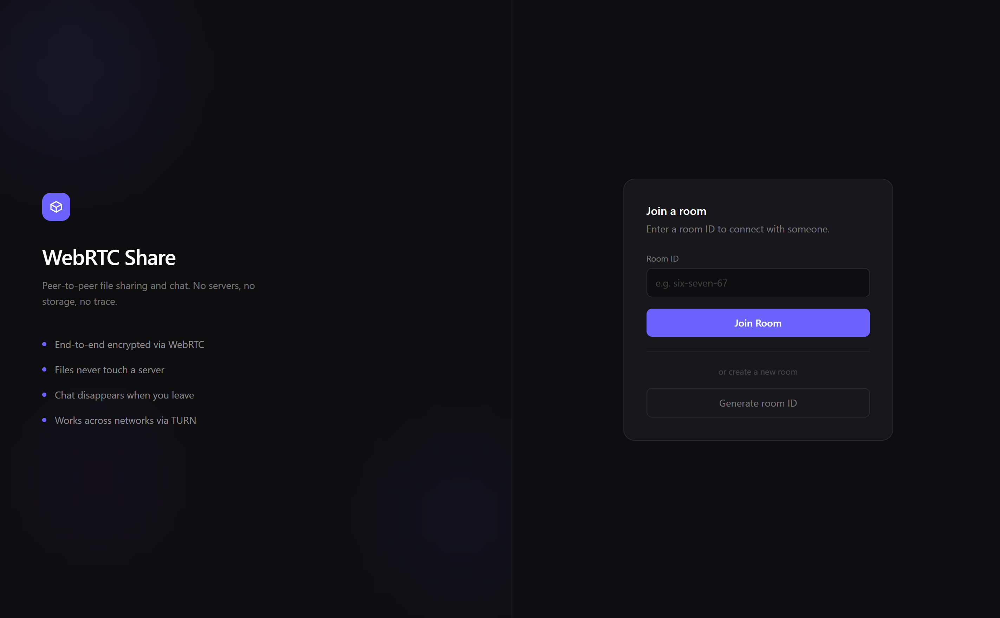
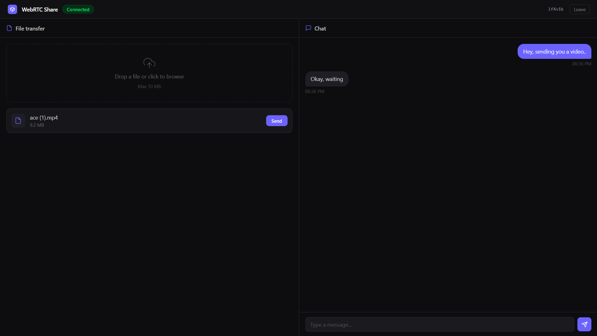
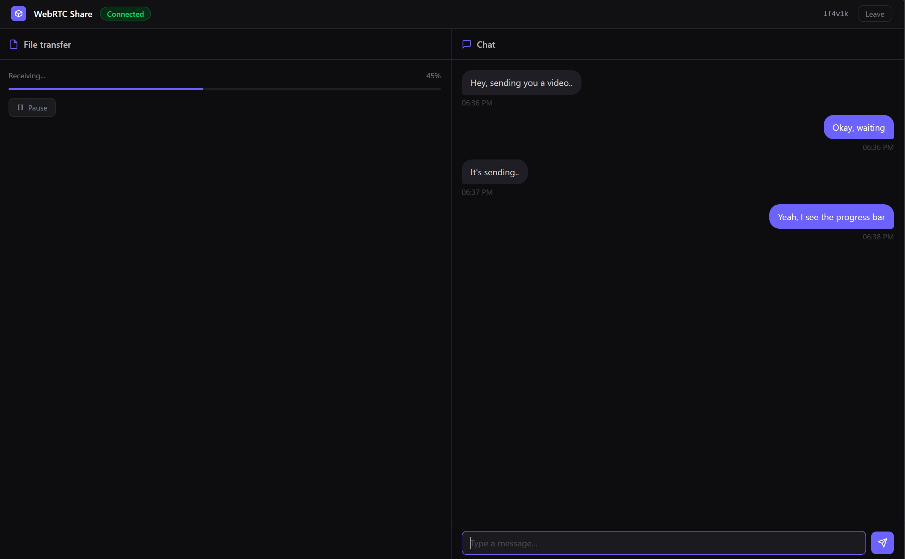

# WebRTC Share

A peer-to-peer file sharing and chat application built with WebRTC. Files and messages are transferred directly between browsers — nothing touches a server.



(./images/received.png)

## Features

- **P2P file transfer** — files are sent directly between peers, never uploaded to a server
- **Pause, resume, and cancel** transfers mid-flight
- **Real-time chat** over the same WebRTC data channel
- **Works across networks** — TURN relay via Metered.ca for NAT traversal
- **Encrypted** — WebRTC uses DTLS-SRTP encryption by default

## How it works

```
Peer A                  Signaling Server              Peer B
  |                          |                           |
  |------- join-room ------->|                           |
  |                          |<------ join-room ---------|
  |<------ peer-joined ------|                           |
  |------- offer ----------->|------- offer ------------>|
  |<------ answer -----------|<------ answer ------------|
  |------- ice-candidate --->|------- ice-candidate ---->|
  |                          |                           |
  |<========= direct P2P data channel =================>|
  |              (files + chat, no server)               |
```

Once the WebRTC connection is established, the signaling server is no longer involved. All file chunks and chat messages flow directly between peers.

## Project structure

```
webrtc-share/
  client/         — React + Vite frontend
  server/         — Node.js + Express + Socket.IO signaling server
  images/         — Project Images
```

## Getting started

### Prerequisites

- Node.js 20+
- A [Metered.ca](https://metered.ca) account for TURN credentials

### 1. Clone the repo

```bash
git clone https://github.com/AyushK-26/webrtc-share.git
cd webrtc-share
```

### 2. Set up the server

```bash
cd server
npm install
cp .env.example .env
# fill in your Metered API key in .env
npm run dev
```

### 3. Set up the client

```bash
cd client
npm install
cp .env.example .env
# set VITE_SERVER_URL to your server URL in .env
npm run dev
```

### 4. Open two browser windows

Navigate to `http://localhost:5173`, enter the same room ID in both windows, and connect.

## Deployment

See [client/README.md](./client/README.md) and [server/README.md](./server/README.md) for deployment instructions.

## Tech stack

| Layer         | Technology                                 |
| ------------- | ------------------------------------------ |
| Frontend      | React, Vite, Tailwind CSS v4               |
| Signaling     | Node.js, Express, Socket.IO                |
| P2P           | WebRTC (RTCPeerConnection, RTCDataChannel) |
| NAT traversal | STUN (Google), TURN (Metered.ca)           |
| Hosting       | Render (server + client)                   |

## Architecture decisions

- **Data channel for everything** — both file chunks and chat messages go over the WebRTC data channel, keeping the architecture truly P2P with no server relay for data
- **Chunked transfer** — files are split into 16KB chunks with `bufferedAmount` flow control to avoid overwhelming the data channel buffer
- **Signaling only** — the server's only job is to relay SDP offer/answer and ICE candidates during connection setup, it never sees file data or chat messages
